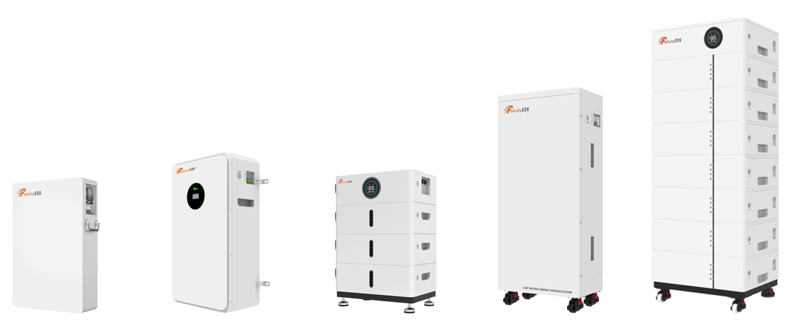
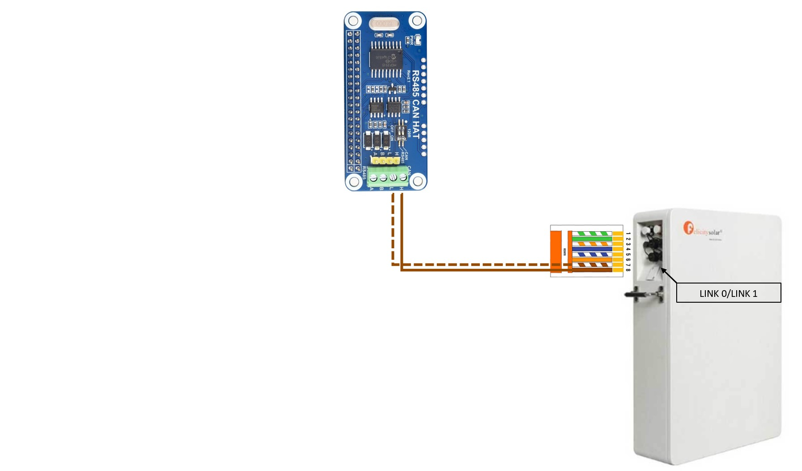
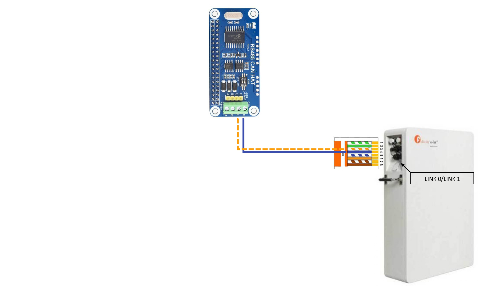

# CAN zu MQTT Schnittstelle für die Felicity LUX-Serie

<p align="center">
  
</p>

Dieses Projekt bietet eine Schnittstelle zwischen CAN-Kommunikation und MQTT für die Felicity LUX Speicher. Es ermöglicht dem Speicher, mit einem MQTT-Broker zu kommunizieren, um verschiedene Topics zu veröffentlichen, was eine Fernüberwachung ermöglicht. 

## Inhaltsverzeichnis
- [Übersicht](#übersicht)
- [Funktionen](#funktionen)
- [Setup und Installation](#setup-und-installation)
- [Konfiguration](#konfiguration)
- [Verwendung](#verwendung)
- [MQTT-Topics](#mqtt-topics)
- [Lizenz](#lizenz)

## Übersicht
Das Skript liest Daten von dem Speicher über CAN, verarbeitet sie und veröffentlicht sie an einen MQTT-Broker.

## Funktionen
- Lesen von Registerwerten über CAN
- Veröffentlichen der Daten an MQTT-Topics
- Protokollierung von Ereignissen und Fehlern

## Setup und Installation
### Benötigte Hardware
- Raspberry Pi
- SD-Karte
- [RS485 CAN HAT](https://www.amazon.de/gp/product/B09JKJCMHN)

### Voraussetzungen
- Python 3.x
- `can` Bibliothek für CANBUS
- `paho-mqtt` Bibliothek für MQTT-Kommunikation

### CAN Verkabelung

#### LUX-E-48100LG04

Stelle sicher, dass die Batterie richtig am RPi angeschlossen ist.

| LINK 0/LINK 1                | RPi RS485 CAN HAT (mit 120 Ohm Widerstand)                  |
|------------------------------|-------------------------------------|
| Pin 7                        | Anschluss L                         |
| Pin 8                        | Anschluss H                         | 

<p align="center">
  
</p>

#### Alle Anderen LUX Speicher

Stelle sicher, dass die Batterie richtig am RPi angeschlossen ist.

| LINK 0/LINK 1                | RPi RS485 CAN HAT (mit 120 Ohm Widerstand)                  |
|------------------------------|-------------------------------------|
| Pin 3                        | Anschluss L                         |
| Pin 4                        | Anschluss H                         | 

<p align="center">
  
</p>

### Installation

#### 1. [Installation RPi OS](https://www.raspberrypi.com/documentation/computers/getting-started.html)
#### 2. Installation RS485 CAN HAT
[RS485 CAN HAT am RPi](https://www.waveshare.com/wiki/RS485_CAN_HAT#CAN_Usage) nach Anleitung installieren und einrichten.

#### 3. Vorbereitungen am RPi
##### RPi OS und Pakete auf den aktuellen Stand bringen
```bash
sudo apt-get update
sudo apt-get upgrade -y
```
##### Installation von Python3 und der benötigten Bibliotheken
```bash
sudo apt-get install python3
sudo apt-get install python3-can
sudo apt-get install python3-paho-mqtt
```
##### Neustart des RPi
```bash
sudo reboot
```
#### 4. Installation des Programms
##### Programm auf den RPi hochladen
Lade das Programm als ZIP-Datei von Patreon herunter und entpacke es. Übertrage anschließend den entpackten Ordner mit einem FTP-Programm auf deinen Raspberry Pi in das Verzeichnis /home/pi/.

##### Öffne das Projektverzeichnis
```bash
cd Feli_LUX_CAN_to_MQTT
```
##### Anpassen der [Konfiguration](#konfiguration) des Programms
```bash
sudo nano feli_lux_can_to_mqtt_config.py
```
Hinweis: Editor mit STRG+X beenden, dabei das Speichern nicht vergessen! „Save modified buffer?“ -> y

##### Fertig!
Die [Verwendung](#verwendung) des Programmes ist nachfolgend beschrieben

## Konfiguration
### Batterie Konfiguration
Setze die Batterie-Nummer (falls mehrere Batterien ausgelesen werden):
```python
Felicity_Nr = "0001"
```

### CAN Konfiguration
Herausfinden des angeschlossenen CAN
```bash
sudo ifconfig
```

Setzen der CAN Schnittstelle:
```python
CAN_channel = "can0"
```

### MQTT Konfiguration
Setze die Verbindungsparameter des MQTT-Brokers:
```python
MQTT_BROKER = "192.168.178.123"
MQTT_PORT = 1883
MQTT_USERNAME = "mqtt"
MQTT_PASSWORD = "12345"
```

### Protokollierung
Das Skript protokolliert verschiedene Ereignisse und Fehler. Die Protokolldatei wird durch die Variable `LOG_FILE` angegeben. Setze hierfür die Protokollierungsparameter:
```python
LOG_LEVEL = logging.INFO
LOG_FILE = "/home/pi/Feli_LUX_CAN_to_MQTT/feli_lux_can_to_mqtt.log"
```
#### Protokollierungsstufen
- `DEBUG`: Detaillierte Informationen zur Diagnose von Problemen.
- `INFO`: Bestätigung, dass alles wie erwartet funktioniert.
- `WARNING`: Ein Hinweis darauf, dass etwas Unerwartetes passiert ist.
- `ERROR`: Ein ernsteres Problem.
- `CRITICAL`: Ein sehr ernstes Problem.

## Verwendung

### Ausführen des Programms
Führe das Skript aus:
   ```bash
   python3 feli_lux_can_to_mqtt.py
   ```

### Service einrichten
Erstelle eine neue Service-Datei für systemd
```bash
sudo nano /etc/systemd/system/feli_lux_can_to_mqtt.service
```

Füge folgenden Inhalt ein (bitte Pfad anpassen)
```bash
[Unit]
Description=CAN to MQTT Service for Felicity LUX
After=network.target network-online.target
Wants=network-online.target

[Service]
ExecStart=/usr/bin/python3 /home/pi/Feli_LUX_CAN_to_MQTT/feli_lux_can_to_mqtt.py
WorkingDirectory=/home/pi/Feli_LUX_CAN_to_MQTT
StandardOutput=inherit
StandardError=inherit
Restart=always
User=pi

[Install]
WantedBy=multi-user.target
```

Aktiviere den neuen Service, sodass er beim Booten automatisch gestartet wird.
```bash
sudo systemctl enable feli_lux_can_to_mqtt.service
```

Starte den Service
```bash
sudo systemctl start feli_lux_can_to_mqtt.service
```

## MQTT Topics

Ersetze `{Felicity_Nr}` durch die tatsächliche Speicher-Nummer in allen Topics.

| Basis-Topic                                               |
|-----------------------------------------------------------|
| solar/feli_lux_battery/{Felicity_Nr}/                     |

Die vollständigen MQTT-Topics setzen sich aus dem Basis-Topic und dem jeweiligen Feldnamen zusammen.
Beispiel: `solar/feli_lux_battery/0001/Battery_SOC`

| Feldname                                  | Beschreibung                       | Wert                                              |
|-------------------------------------------|------------------------------------|---------------------------------------------------|
| Battery_SOC                               | Ladezustand                        | Integer (in %)                                    |
| Battery_SOH                               | Gesundheitszustand                 | Integer (in %)                                    |
| -                                         | -                                  | -                                                 |
| Battery_Voltage                           | Spannung                           | Gleitkommazahl (in Volt)                          |
| Battery_Current                           | Strom                              | Gleitkommazahl (in Ampere)                        |
| Battery_Power                             | Leistung                           | Gleitkommazahl (in Watt)                          |
| Battery_Temperature_Avg                   | Durchschnittliche Zelltemperatur   | Gleitkommazahl (in °C)                            |
| -                                         | -                                  | -                                                 |
| Battery_Voltage_Limit_Charge              | Ladespannungsgrenze                | Gleitkommazahl (in Volt)                          |
| Battery_Current_Limit_Charge              | Ladestromgrenze                    | Gleitkommazahl (in Ampere)                        |
| Battery_Voltage_Limit_Discharge           | Entladespannungsgrenze             | Gleitkommazahl (in Volt)                          |
| Battery_Current_Limit_Discharge           | Entladestromgrenze                 | Gleitkommazahl (in Ampere)                        |
| -                                         | -                                  | -                                                 |
| Battery_Charge_Enable                     | Laden erlaubt                      | String ("on" oder "off")                          |
| Battery_Discharge_Enable                  | Entladen erlaubt                   | String ("on" oder "off")                          |
| Battery_Full_Charge_Request               | SOC-Kalibrierung angefordert       | String ("on" oder "off")                          |
| -                                         | -                                  | -                                                 |
| Battery_Protection_Over_Voltage           | Überspannung                       | String ("on" oder "off")                          |
| Battery_Protection_Under_Voltage          | Unterspannung                      | String ("on" oder "off")                          |
| Battery_Protection_Over_Temperature       | Übertemperatur                     | String ("on" oder "off")                          |
| Battery_Protection_Under_Temperature      | Untertemperatur                    | String ("on" oder "off")                          |
| Battery_Protection_Discharge_Over_Current | Entladestrom zu hoch               | String ("on" oder "off")                          |
| Battery_Protection_Charge_Over_Current    | Ladestrom zu hoch                  | String ("on" oder "off")                          |
| Battery_Protection_System_Error           | Systemfehler                       | String ("on" oder "off")                          |
| -                                         | -                                  | -                                                 |
| Battery_Alarm_High_Voltage                | Überspannungswarnung               | String ("on" oder "off")                          |
| Battery_Alarm_Low_Voltage                 | Unterspannungswarnung              | String ("on" oder "off")                          |
| Battery_Alarm_High_Temperature            | Übertemperaturwarnung              | String ("on" oder "off")                          |
| Battery_Alarm_Low_Temperature             | Untertemperaturwarnung             | String ("on" oder "off")                          |
| Battery_Alarm_Discharge_High_Current      | Entladestromwarnung                | String ("on" oder "off")                          |
| Battery_Alarm_Charge_High_Current         | Ladestromwarnung                   | String ("on" oder "off")                          |

## Lizenz
Dieses Projekt ist unter der MIT-Lizenz lizenziert. Siehe die [LICENSE](LICENSE) Datei für Details.
